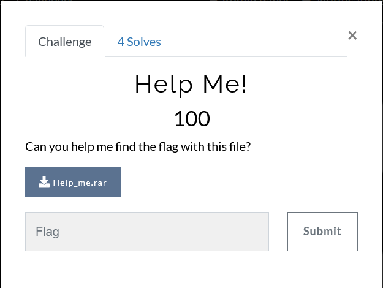
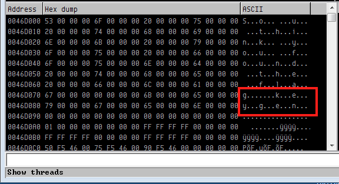

Challenge:

Solution:

For this reversing challenge, you are given a 32-bit PE binary along with a text file which had an useless ceasar cipher text. You can start by using static analysis with IDA and quickly figure out that it expected 4 arguments, all of which had to be numbers.Here's how the binary behaves based on the arguments provided:

C:\Users\Shreera\Desktop>source.exe

Epic Fail!

C:\Users\Shreeraj\Desktop>source.exe aaaa aaaa aaaa aaaa

Hogwarts

C:\Users\koji\Desktop>source.exe 1 2 3 4

4 digit numbers are the way forward

C:\Users\koji\Desktop>source 1111 2222 3333 4444

So u think you found the flag

The last case here was interesting, in that the string "So you think you found the flag", was nowhere to be found in the binary. Perhaps it was being generated on the fly. Looking into it further, you can trace the execution to a function called getdigs() at 0x0040151D. It takes a pointer to an int, in this case, the first argument we provided. Looking at the assembly, it was clear that it was performing some math on each of the digits in the four digit argument. You can load it up in Immunity Debugger, but before I could set a breakpoint at getdigs(), I noticed something interesting in the dump window, which you can see  in the repo as ss.png

That's the string "So u think you found the flag", and a little bit more. Right after it was the text "keygen"

After entering it in the ctf window, that was infact the flag!

So thats it!!

