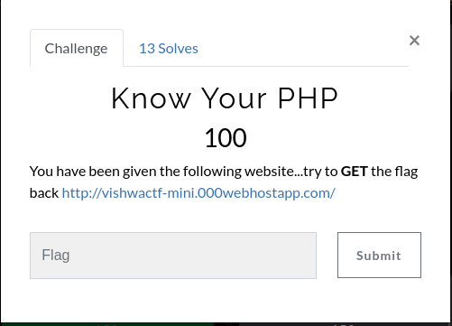
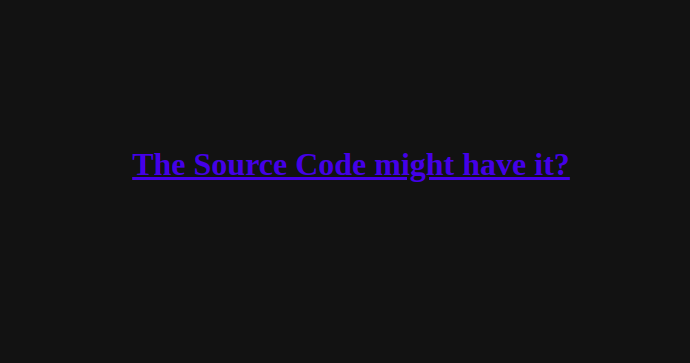
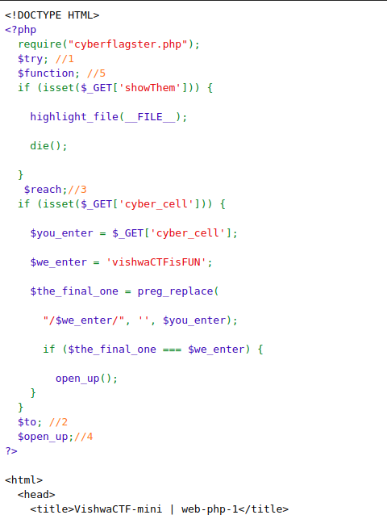
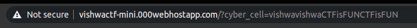
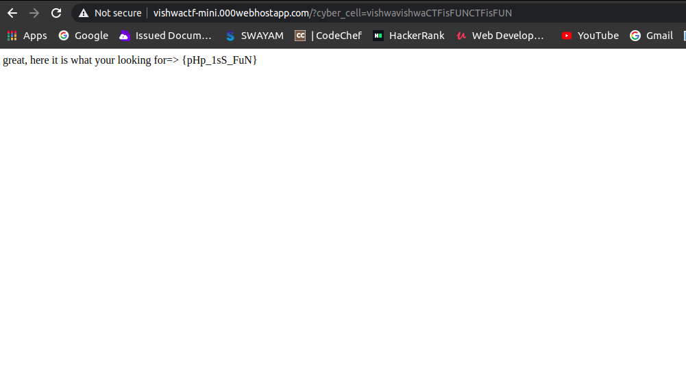

## Know Your PHP

Title : Know Your PHP

Category : Web

Description : You have been given the following website...try to GET the flag back http://vishwactf-mini.000webhostapp.com/

Hints : None

Points : 100

Solves : 9

Flags : vishwaCTF{pHp_1sS_FuN}

## Writeup

This belongs to web category. and from the title it's pretty much clear that it's gonna be something related to php, the God's own language XD.

So after clicking on the link, a webpage appears: 

and further clicking on "the source code might have it"
we reach : 

Now this is the real deal. The PHP source code. When you see the code, it's pretty easy to say that we gotta call the "open up" function. 

Now let's look into source code,
> cyber_cell : It is a GET parameter. we can supply its value as:
http://vishwactf-mini.000webhostapp.com/?cyber_cell=[some-text-here]

> $you_enter : Our supplied input via "cyber_cell" parameter is stored in this variable.

> $we_enter : it contains a string ‘vishwaCTFisFUN’.

> $the_final_one : It contains the result of the preg_replace function.

Then a final check is taking place, if final_string is equals to we_enter(i.e. vishwaCTFisFUN) then the "open_up()" is getting called and eventually we will get the flag.

Now lets focus on preg_replace function , it is taking three arguments 
>we_enter, ' ', you_enter

You can Google for preg_replace function in php!
After reading the preg_replace function’s manual on google it will be evident that our supplied input(or substring of our input) is getting compared to string vishwaCTFisFUN, and if they are equal then our supplied input is getting replaced with ' ' (which is blank) . But in the final_string we need vishwaCTFisFUN, how it is possible when it is getting replaced with ' ' ?

So we can create a final input like : vishwavishwaCTFisFUNCTFisFUN

vishwavishwaCTFisFUNCTFisFUN , here even if the vishwaCTFisFUN gets replaced with ' ' , the starting vishwa and ending CTFisFUN will addup and make a new vishwaCTFisFUN 

BOOM! and there we have it!  PHP is FUN, isn't it?

